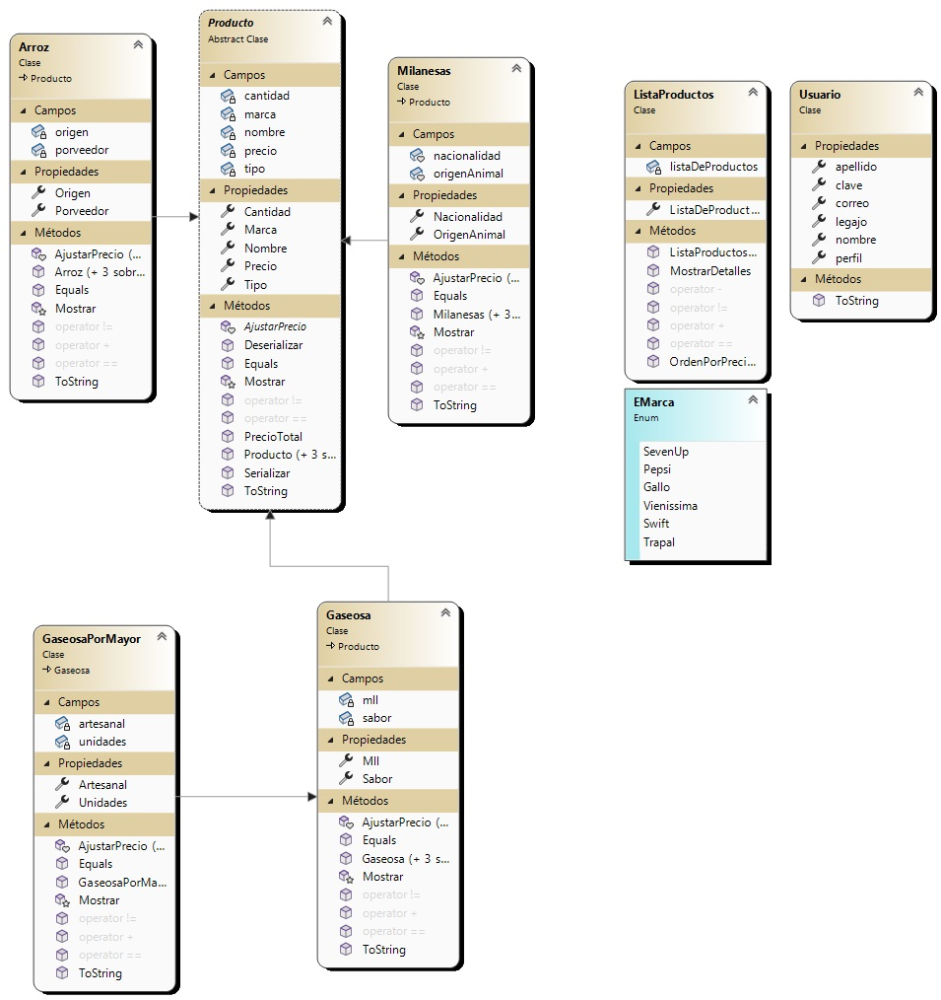
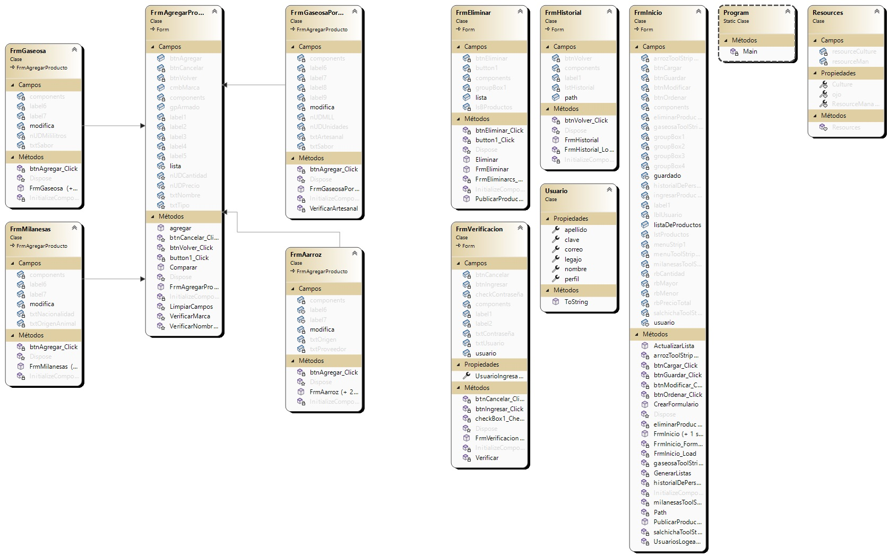

# Título: Control de stock mayorista Trapal

# Sobre mi:
Me llamo Fernando Ezequiel Espinoza,tengo 22 años y actualmente estoy cursando el primer año de la Tecnicatura en Programación en la Universided Tecnológica Nacional.
Me gusta mucho todo lo que respecta a la lógica de programación e hice este CRUD tal vez no con tanta estética,pero es lindo y anda. Espero que les guste :D.

# Resumen:
Se inicializa el programa con un formulario de login para verificar si las credenciales presentadas coinciden con nuestra base de datos.
En el caso de que se pueda logear con éxito va a ser dirigido a una interfaz donde lo primero que se va a poder visualizar son los productos previamente cargados.
Tendra controles de ordenamiento y un menú para diversas opciones.
Las opciones que se pueden encontrar son las de agregar 3 tipos de productos diferentes, eliminar productos de la lista o visualizar el historial de personas que se logearon en la aplicación.
Todos los cambios que se hagan se podran guardar en la carpeta a elección asi como cargar archivos externos.

# Diagrama de clases: Biblioteca de Clases.

# Diagrama de clases: Crud de Control de stock.

